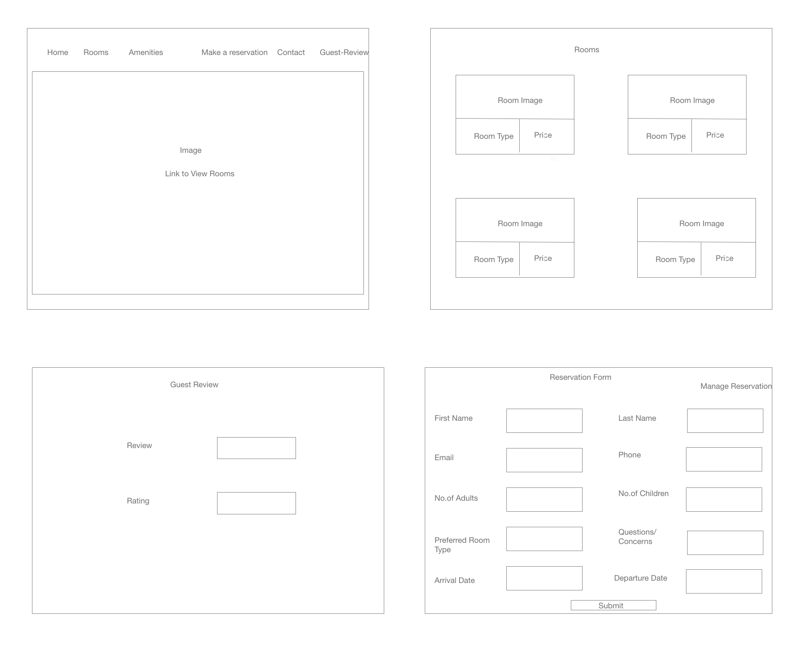

## Hotel  - Room Reservation App
## Link: hotel-reservation.surge.sh

## Technologies Used:
ReactJS, Springboot JPA, PostgreSql
## Installations needed:
#### npm install axios
#### npm install react-router-dom
#### npm install react-bootstrap 

## API used:
TripAdvisor API to display nearby attractions and restaurants

## Problem Statement:
The stakeholder needs to create a website for their hotel with latest web development technology and to make online reservation for customers.

## Proposition:
Creating a hotel website with React as front end framework and Springboot JPA as backend framework. Added online reservation form as additional feature.

## Target End Users:
Helping customers who want to manage their online room reservation

## Next Steps:

Add purchase functionality.
Add authentication functionality.

## Wireframe:

## Resources:
1. https://react-bootstrap.github.io/components/forms/

